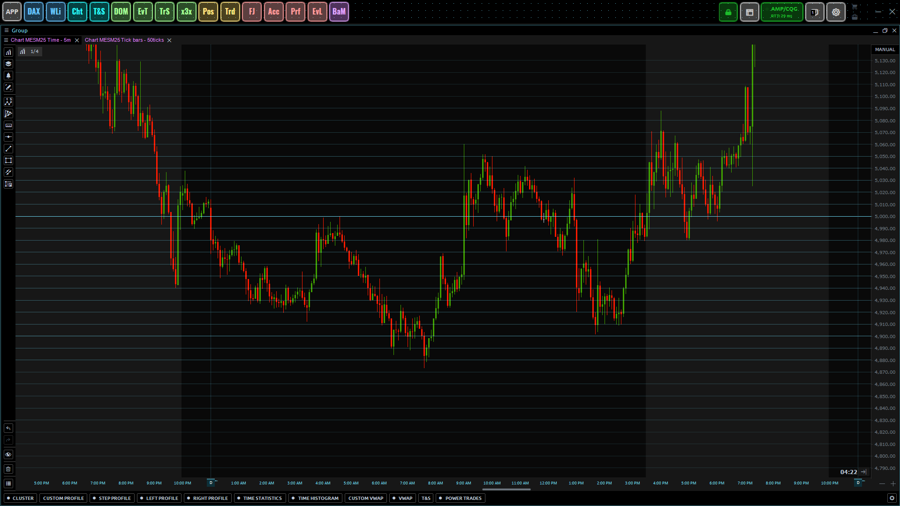

# Psychological Round Level Indicator

- License: **[GPL-3.0 License](./license.txt)**

Welcome to the `Psychological Round Level Indicator` project! 
  PsyRoundLevel is a custom indicator designed to highlight psychological 
  round price levels on a financial chart. 

These levels, such as 50, 100, 1000, and 10000, often act as natural support 
  or resistance zones due to human trading behavior. 

This indicator visualizes multiple levels with different levels of transparency 
  to indicate their significance.

## Download And Install

<a
    class="button button--primary"
    href="https://github.com/qtx-project/indicator-psy-round-level/releases/latest/download/indicator.zip"
    download
    target="_blank"
    rel="noopener noreferrer">Download the Latest Release</a>

> [!CAUTION]
> By using this indicator, you acknowledge and agree that **you do so at your own risk**.
> The indicator is intended purely for educational and informational purposes.
>
> **I, the creator, take no responsibility** for any losses or damages (direct, indirect, 
> consequential, or otherwise) that may result from using this indicator in any live 
> trading environment.
>
> - Ensure to test the indicator in a safe and controlled environment 
>   before using it in actual trading.
> - Always verify the behavior of the indicator with backtesting, paper 
>   trading, or in simulation mode.
> - This tool does not guarantee profitable trading outcomes and is not a 
>   substitute for professional financial advice or risk management strategies.
>
> By continuing to use this tool, you acknowledge that you have read, understood, and agree to these terms.

### 1. Extract the ZIP File

Once the `indicator.zip` file is downloaded, open it and extract the 
`PsyRoundLevel` folder.

### 2. Move the indicator to the Appropriate Folder

Move the extracted `PsyRoundLevel` folder into your Quantower 
**indicators directory**. This is typically located at `Quantower/Settings/Indicators/..`

### 3. Restart Quantower

After moving the indicator, restart Quantower to apply the changes and
add the indicator to your chart.

